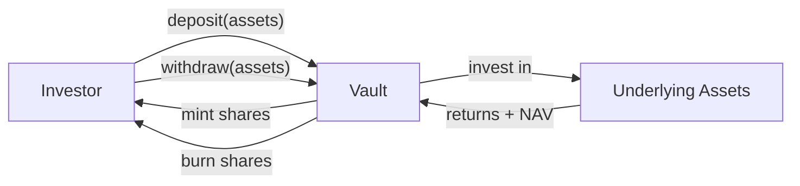

# ERC-4626 — Coffre-fort tokenisé (synchrone) { #erc-4626-tokenised-vault-synchronous }

ERC-4626 standardise l'interface pour les **coffres-forts tokenisés**. Dans Registerwerk, il est utilisé pour les jetons de fonds où les actions sont émises contre un pool d'actifs sous-jacent, le NAV est arrêté (strike) quotidiennement et les dépôts/retraits sont synchrones (immédiats).

Il s'agit de la norme principale pour les **fonds du marché monétaire**, les **fonds de liquidité quotidiens** et les **fonds obligataires à courte durée** au Luxembourg et en France.

---

## Mécanique du coffre-fort { #vault-mechanics }

- **Actifs** : la devise ou l'instrument sous-jacent (généralement EUR, USDC ou une obligation spécifique)
- **Actions** : le jeton ERC-4626 émis aux investisseurs ; représentent la propriété proportionnelle
- **NAV (Valeur nette d'inventaire)** : total des actifs / total des actions — détermine le prix de l'action

---

## Modèle de données { #data-model }

### `AssetVaultState` { #assetvaultstate }

État actuel du coffre-fort :

| Champ | Description |
|---|---|
| `assetId` | FK à `Asset` |
| `totalAssets` | Actifs sous-jacents totaux actuels (depuis le dernier arrêté de NAV) |
| `totalShares` | Total des actions en circulation |
| `navPerShare` | `totalAssets / totalShares` au dernier arrêté |
| `lastNavStrikeAt` | Horodatage du dernier calcul NAV |
| `depositCap` | Dépôts totaux maximum autorisés (0 = illimité) |

### `VaultNavStrike` { #vaultnavstrike }

Enregistrement historique immuable de chaque calcul NAV :

| Champ | Description |
|---|---|
| `assetId` | FK à `Asset` |
| `strikeTime` | Date à laquelle le NAV a été arrêté |
| `navPerShare` | NAV par action à cet arrêté |
| `totalAssets` | Actifs sous-jacents à cet arrêté |
| `totalShares` | Total des actions à cet arrêté |
| `struckBy` | UUID de l'opérateur ou de la tâche automatisée |

Les arrêtés de NAV sont en ajout seul (append-only) et forment un historique de valorisation auditable pour les régulateurs.

---

## Opérations d'administration { #admin-operations }

| Opération | Point de terminaison | Description |
|---|---|---|
| Arrêter le NAV | `POST /api/v1/assets/{id}/vault/nav` | Enregistrer un nouvel arrêté de NAV — REGISTRY_ADMIN + step-up |
| Fixer le plafond de dépôt | `POST /api/v1/assets/{id}/vault/deposit-cap` | Mettre à jour le total maximum des dépôts |
| Suspendre les dépôts | `POST /api/v1/assets/{id}/vault/pause-deposits` | Disjoncteur d'urgence |
| Suspendre les retraits | `POST /api/v1/assets/{id}/vault/pause-withdrawals` | Disjoncteur d'urgence |

L'interface `Erc4626AdminPort` du module `blockchain` expose ces opérations ; l'écran de gestion du coffre-fort de l'interface de l'opérateur les appelle via `VaultController` dans le module `asset`.

---

## Alignement CSSF { #cssf-alignment }

Le cadre de la circulaire CSSF 22/811 du Luxembourg pour les instruments de fonds basés sur la DLT s'aligne étroitement sur le modèle de coffre-fort ERC-4626 :

- Publication quotidienne du NAV → enregistrement en ajout seul `VaultNavStrike`
- Files d'attente de souscription et de rachat → mappées aux flux de dépôt/retrait ERC-4626
- Identification du déposant → intégré à la couche d'identité ERC-3643 (déploiement en tant que combinaison `ERC4626 + ERC3643`)

Pour les fonds institutionnels nécessitant un règlement T+1 ou T+2, utilisez plutôt [ERC-7540](erc7540.md).
