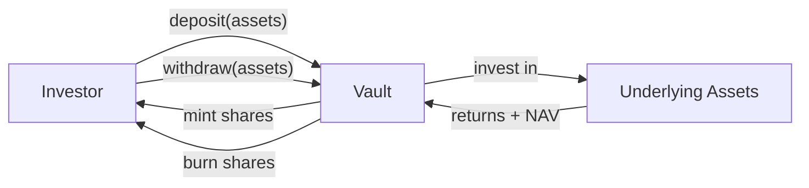

# ERC-4626 — Vault tokenizzato (sincrono) { #erc-4626-tokenised-vault-synchronous }

ERC-4626 standardizza l'interfaccia per **vault tokenizzati fruttiferi**. In Registerwerk, viene utilizzato per i token di fondi in cui le azioni vengono emesse a fronte di un pool di attività sottostante, il NAV viene calcolato quotidianamente e i depositi/prelievi sono sincroni (immediati).

Questo è lo standard principale per **fondi del mercato monetario**, **fondi a liquidità giornaliera** e **fondi obbligazionari a breve durata** nelle giurisdizioni lussemburghese e francese.

---

## Meccanica del vault { #vault-mechanics }

- **Attività**: la valuta o lo strumento sottostante (tipicamente EUR, USDC o un'obbligazione specifica)
- **Azioni**: il token ERC-4626 emesso per gli investitori; rappresentano la proprietà proporzionale
- **NAV (Valore patrimoniale netto)**: totale attivo / totale azioni — determina il prezzo delle azioni

---

## Modello dei dati { #data-model }

### `AssetVaultState` { #assetvaultstate }

Stato attuale del vault:

| Campo | Descrizione |
|---|---|
| `assetId` | FK a `Asset` |
| `totalAssets` | Totale attività sottostanti correnti (dall'ultima valorizzazione del NAV) |
| `totalShares` | Totale azioni in circolazione |
| `navPerShare` | `totalAssets / totalShares` all'ultima valorizzazione |
| `lastNavStrikeAt` | Timestamp dell'ultimo calcolo NAV |
| `depositCap` | Depositi totali massimi consentiti (0 = illimitato) |

### `VaultNavStrike` { #vaultnavstrike }

Record storico immutabile di ogni calcolo NAV:

| Campo | Descrizione |
|---|---|
| `assetId` | FK a `Asset` |
| `strikeTime` | Istante in cui il NAV è stato calcolato |
| `navPerShare` | NAV per azione a questa valorizzazione |
| `totalAssets` | Attività sottostanti a questa valorizzazione |
| `totalShares` | Azioni totali a questa valorizzazione |
| `struckBy` | UUID dell'operatore o del job automatizzato |

Le valorizzazioni del NAV sono di sola aggiunta e formano uno storico dei prezzi verificabile per gli enti di regolamentazione.

---

## Operazioni di amministrazione { #admin-operations }

| Operazione | Endpoint | Descrizione |
|---|---|---|
| Valorizza il NAV | `POST /api/v1/assets/{id}/vault/nav` | Registra un nuovo NAV — REGISTRY_ADMIN + step-up |
| Imposta il limite di deposito | `POST /api/v1/assets/{id}/vault/deposit-cap` | Aggiorna i depositi totali massimi |
| Pausa depositi | `POST /api/v1/assets/{id}/vault/pause-deposits` | Interruttore automatico di emergenza |
| Pausa prelievi | `POST /api/v1/assets/{id}/vault/pause-withdrawals` | Interruttore automatico di emergenza |

L'interfaccia `Erc4626AdminPort` nel modulo `blockchain` espone queste operazioni; la schermata di gestione del vault del frontend dell'operatore le richiama tramite `VaultController` nel modulo `asset`.

---

## Allineamento CSSF { #cssf-alignment }

Il quadro della Circolare CSSF 22/811 del Lussemburgo per gli strumenti di fondi basati su DLT si allinea strettamente al modello di vault ERC-4626:

- Pubblicazione giornaliera del NAV → record di sola aggiunta `VaultNavStrike`
- Code di sottoscrizione e riscatto → mappate sui flussi di deposito/prelievo ERC-4626
- Identificazione del depositante → integrato con il livello di identità ERC-3643 (distribuire come combinazione `ERC4626 + ERC3643`)

Per i fondi istituzionali che richiedono il regolamento T+1 o T+2, utilizzare invece [ERC-7540](erc7540.md).
