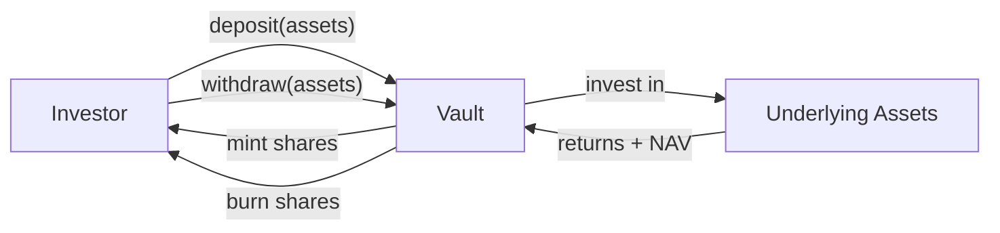

# ERC-4626 — Tokenised Vault (Synchronous)

ERC-4626 standardises the interface for **tokenised yield-bearing vaults**. In Registerwerk, it is used for fund tokens where shares are issued against an underlying asset pool, the NAV is struck daily, and deposits/withdrawals are synchronous (immediate).

This is the primary standard for **money-market funds**, **daily-liquidity funds**, and **short-duration bond funds** in Luxembourg and French jurisdictions.

---

## Vault mechanics

- **Assets**: the underlying currency or instrument (typically EUR, USDC, or a specific bond)
- **Shares**: the ERC-4626 token issued to investors; represent proportional ownership
- **NAV (Net Asset Value)**: total assets / total shares — determines the share price

---

## Data model

### `AssetVaultState`

Current state of the vault:

| Field | Description |
|---|---|
| `assetId` | FK to `Asset` |
| `totalAssets` | Current total underlying assets (from last NAV strike) |
| `totalShares` | Total outstanding shares |
| `navPerShare` | `totalAssets / totalShares` at last strike |
| `lastNavStrikeAt` | Timestamp of last NAV calculation |
| `depositCap` | Maximum allowed total deposits (0 = unlimited) |

### `VaultNavStrike`

Immutable historical record of each NAV calculation:

| Field | Description |
|---|---|
| `assetId` | FK to `Asset` |
| `strikeTime` | When the NAV was struck |
| `navPerShare` | NAV per share at this strike |
| `totalAssets` | Underlying assets at this strike |
| `totalShares` | Total shares at this strike |
| `struckBy` | UUID of the operator or automated job |

NAV strikes are append-only and form an auditable pricing history for regulators.

---

## Admin operations

| Operation | Endpoint | Description |
|---|---|---|
| Strike NAV | `POST /api/v1/assets/{id}/vault/nav` | Record a new NAV — REGISTRY_ADMIN + step-up |
| Set deposit cap | `POST /api/v1/assets/{id}/vault/deposit-cap` | Update the maximum total deposits |
| Pause deposits | `POST /api/v1/assets/{id}/vault/pause-deposits` | Emergency circuit breaker |
| Pause withdrawals | `POST /api/v1/assets/{id}/vault/pause-withdrawals` | Emergency circuit breaker |

The `Erc4626AdminPort` interface in the `blockchain` module exposes these operations; the operator frontend's vault management screen calls them through `VaultController` in the `asset` module.

---

## CSSF alignment

The Luxembourg CSSF Circular 22/811 framework for DLT-based fund instruments aligns closely with the ERC-4626 vault model:

- Daily NAV publication → `VaultNavStrike` append-only record
- Subscription and redemption queues → mapped to ERC-4626 deposit/withdraw flows
- Depositor identification → integrated with ERC-3643 identity layer (deploy as `ERC4626 + ERC3643` combination)

For institutional funds requiring T+1 or T+2 settlement, use [ERC-7540](erc7540.md) instead.
