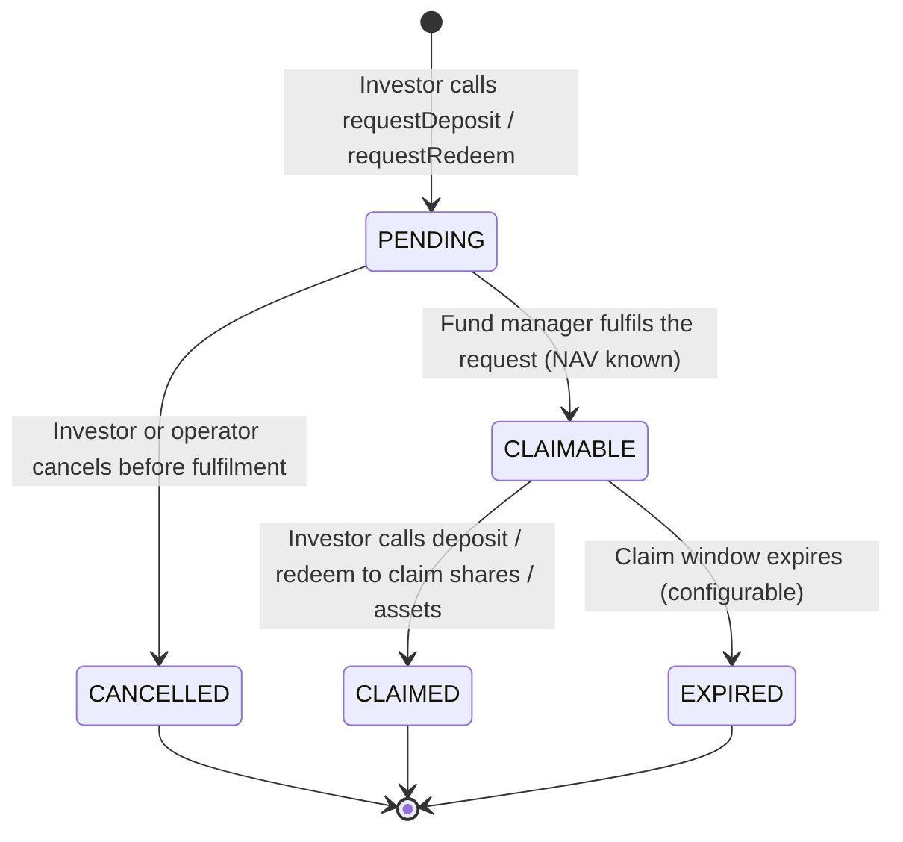

# ERC-7540 – Asynchroner Tresor { #erc-7540-asynchronous-vault }

ERC-7540 erweitert ERC-4626 für Fonds, die Einzahlungen oder Rücknahmen nicht sofort verarbeiten
können. Stattdessen stellen Anleger **Anträge**, die der Fondsmanager in einem separaten
Abwicklungsschritt bearbeitet. Dies modelliert die reale T+1/T+2-Abwicklung für institutionelle
Fondsanteile und ist der Standard für **alternative Investmentfonds**, **halbliquide Fonds** und
alle Vehikel, bei denen Rücknahmesperren gelten.

---

## Antrags-/Anspruchslebenszyklus { #requestclaim-lifecycle }

---

## Die Entität `VaultRequest` { #vaultrequest-entity }

Jeder Einzahlungs- oder Rücknahmeantrag wird in der Entität `VaultRequest` erfasst:

| Feld | Beschreibung |
|---|---|
| `assetId` | FK zu `Asset` |
| `requestType` | `DEPOSIT` oder `REDEEM` |
| `requestorAddress` | Wallet-Adresse des Anlegers |
| `requestedAmount` | Vermögenswerte (bei Einzahlung) oder Anteile (bei Rücknahme) |
| `status` | `PENDING` / `CLAIMABLE` / `CLAIMED` / `CANCELLED` / `EXPIRED` |
| `requestedAt` | Wann der Antrag eingereicht wurde |
| `fulfilledAt` | Wann der Fondsmanager ihn bearbeitet hat |
| `navAtFulfilment` | Der für die Abwicklung verwendete NAV pro Anteil |
| `settledAmount` | Tatsächlich erhaltene Anteile (Einzahlung) oder erhaltene Vermögenswerte (Rücknahme) |
| `claimDeadline` | Wann der Anspruchsstatus abläuft |

---

## Fondsmanager-Operationen { #fund-manager-operations }

| Operation | Endpunkt | Beschreibung |
|---|---|---|
| Einzahlung erfüllen | `POST /api/v1/assets/{id}/vault/fulfil-deposit` | Ausstehende Einzahlungsanträge bearbeiten |
| Rücknahme erfüllen | `POST /api/v1/assets/{id}/vault/fulfil-redeem` | Ausstehende Rücknahmeanträge bearbeiten |
| Antrag stornieren | `POST /api/v1/assets/{id}/vault/cancel-request` | Einen ausstehenden Antrag stornieren (Betreiber oder Anleger) |
| Ausstehende Anträge auflisten | `GET /api/v1/assets/{id}/vault/requests?status=PENDING` | Warteschlange anzeigen |

Alle Erfüllungsvorgänge erfordern REGISTRY_ADMIN und verwenden den NAV aus dem neuesten
`VaultNavStrike`. Sie sind in `Erc7540AdminPort` implementiert.

---

## Rücknahmesperren (Redemption Gates) { #redemption-gates }

Rücknahmesperren begrenzen den Gesamtbetrag, der in einem einzelnen Abwicklungszyklus
zurückgenommen werden kann. Das schützt die Liquidität in halbliquiden alternativen Fonds. In
Registerwerk:

- `AssetVaultState.redemptionGate` – maximaler Prozentsatz der pro Zyklus rücknehmbaren
  Gesamtanteile (0 = keine Sperre)
- Überschreiten Anträge in einem Zyklus die Sperre, werden sie anteilig (pro rata) erfüllt; der
  Rest wird auf den nächsten Zyklus übertragen
- `VaultController` im Modul `asset` erzwingt die Sperre, bevor
  `Erc7540AdminPort.fulfillRedeemRequest` aufgerufen wird

---

## Verhältnis zu ERC-4626 { #relationship-to-erc-4626 }

ERC-7540 ist eine strikte Obermenge von ERC-4626: Jeder ERC-7540-Tresor implementiert auch die
ERC-4626-Schnittstelle. Der Unterschied besteht darin, dass die Funktionen `deposit()` und
`redeem()` nicht sofort abrechnen, sondern stattdessen einen zuvor eingereichten und erfüllten
Antrag abschließen.

Für Fonds, die eine sofortige Abwicklung erfordern, verwenden Sie [ERC-4626](erc4626.md).
