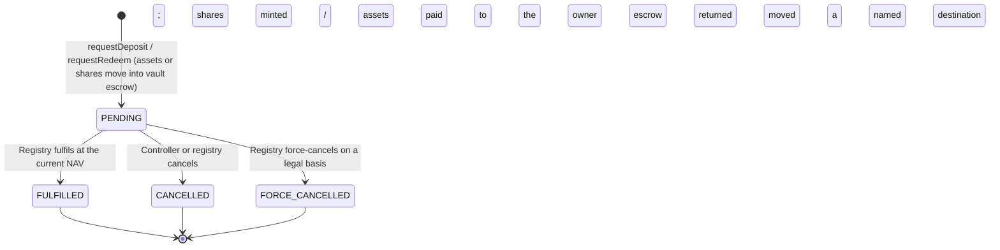

# ERC-7540 – Asynchroner Tresor { #erc-7540-asynchronous-vault }

ERC-7540 erweitert ERC-4626 für Fonds, die Einzahlungen oder Rücknahmen nicht sofort verarbeiten
können. Stattdessen stellen Anleger **Anträge**, die der Fondsmanager in einem separaten
Abwicklungsschritt bearbeitet. Dies modelliert die reale T+1/T+2-Abwicklung für institutionelle
Fondsanteile und ist der Standard für **alternative Investmentfonds**, **halbliquide Fonds** und
alle Vehikel, bei denen Rücknahmesperren gelten.

---

## Antragslebenszyklus { #request-lifecycle }

`EwpgERC7540` rechnet per **Push-Abwicklung** ab: Erfüllt die Registerstelle einen Antrag, prägt
der Tresor in derselben Transaktion die Anteile an den Antragsinhaber (Einzahlung) bzw. zahlt ihm die
zugrunde liegenden Vermögenswerte aus (Rücknahme). Es gibt keinen Status `CLAIMABLE` und keinen
separaten Abholschritt.

```mermaid
stateDiagram-v2
    [*] --> PENDING : requestDeposit / requestRedeem (assets or shares move into vault escrow)
    PENDING --> FULFILLED : Registry fulfils at the current NAV; shares minted / assets paid to the owner
    PENDING --> CANCELLED : Controller or registry cancels; escrow returned
    PENDING --> FORCE_CANCELLED : Registry force-cancels on a legal basis; escrow moved to a named destination
    FULFILLED --> [*]
    CANCELLED --> [*]
    FORCE_CANCELLED --> [*]
```

- **Einzahlungsantrag:** Der Aufrufer (der *Zahler*) überträgt die Vermögenswerte in den Tresor.
  Weder Zahler noch Inhaber dürfen eingefroren sein, und der Inhaber muss auf der Whitelist stehen.
  Der Tresor speichert den Zahler (`depositRequestPayer(id)`). Eine Stornierung erstattet an den
  Zahler, nicht an den Inhaber.
- **Rücknahmeantrag:** Die Anteile des Inhabers gehen in die Eigenverwahrung des Tresors, bis der
  Antrag erfüllt oder storniert wird. Eine Stornierung gibt sie an den Inhaber zurück.
- Die **Erfüllung** ist der Registerstelle vorbehalten. Sie setzt einen NAV-Strike und den Ablauf von
  `minSettlementDelay` voraus und rechnet zum im Erfüllungszeitpunkt aktuellen NAV ab.
- Die synchronen ERC-4626-Einstiegspunkte (`deposit`, `mint`, `withdraw`, `redeem`) revertieren mit
  `AsyncOnly`, und die zugehörigen `max*`-Abfragen liefern `0`.

### Ausstehende Zeichnungen sind Treuhandvermögen, kein Fondsvermögen { #pending-subscriptions-are-escrow-not-fund-assets }

Die Vermögenswerte ausstehender Einzahlungsanträge werden treuhänderisch gehalten. Sie werden in
`pendingDepositAssets()` geführt und aus `totalAssets()` herausgerechnet. Eine Rücknahme kann nur aus
abgewickelten Vermögenswerten bezahlt werden. Übersteigt die Auszahlung diese, revertiert
`fulfillRedeemRequest` mit `EwpgERC7540: insufficient settled liquidity`. Eine Rücknahme wird also
nie aus der noch nicht abgewickelten Zeichnung eines anderen Anlegers finanziert, und diese Zeichnung
kann immer storniert und erstattet werden.

!!! note "`totalAssets()` enthält keine ausstehenden Zeichnungen"
    `totalAssets()` liefert den Bestand des Tresors an zugrunde liegenden Vermögenswerten abzüglich
    `pendingDepositAssets()`. Dashboards oder Indexer, die `totalAssets()` als verwaltetes Vermögen
    lesen, zeigen niedrigere, korrekte Werte als bei früheren Tresor-Deployments.

---

## Compliance-Sperren und erzwungene Stornierung { #compliance-holds-and-forced-cancellation }

Eine eingefrorene Adresse wird an Ort und Stelle festgehalten:

- `fulfillRedeemRequest` revertiert, solange der Antragsinhaber eingefroren ist. Eine
  Einzahlungserfüllung an einen eingefrorenen Inhaber blockiert der Compliance-Hook des
  Anteilstransfers.
- `cancelDepositRequest` revertiert, solange der Erstattungsempfänger (der Zahler) eingefroren ist.
  `cancelRedeemRequest` revertiert, solange der Inhaber eingefroren ist.
- Die treuhänderisch gehaltenen Vermögenswerte oder Anteile bleiben im Tresor, bis die Adresse
  wieder freigegeben wird.
- `forcedTransfer`, `forceBurn` und `forcedApprove` revertieren, wenn sie auf die Adresse des
  Tresors selbst angewendet werden. Die Eigenverwahrung des Tresors hält die Anteile aller
  ausstehenden Rücknahmen; eine erzwungene Operation darauf würde die Anträge anderer Anleger
  unfinanzierbar machen.

Um einen gesperrten Antrag auf einer Rechtsgrundlage aufzulösen, ruft die Registerstelle
`forceCancelDepositRequest(id, to, legalBasis)` oder `forceCancelRedeemRequest(id, to, legalBasis)`
auf. Das Treuhandvermögen (Vermögenswerte oder Anteile) geht an das für den Einzelfall benannte Ziel
`to`, und der Tresor emittiert `ForcedRequestCancelled(requestId, to, legalBasis)`. Andere
ausstehende Anträge bleiben unberührt.

!!! note "Zielvorgabe"
    Der Vertrag entscheidet nicht, wohin das Treuhandvermögen eines eingefrorenen Anlegers geht.
    Standardmäßig bleibt es im Tresor. Ob und wann es auf ein von der Registerstelle kontrolliertes
    Sperrkonto oder anderswohin übertragen wird, ist eine fachliche und rechtliche Entscheidung im
    Einzelfall.

---

## Die Entität `VaultRequest` { #vaultrequest-entity }

Jeder Einzahlungs- oder Rücknahmeantrag wird in der Entität `VaultRequest` erfasst. Anleger rufen `requestDeposit` / `requestRedeem` direkt am Vault auf; das Backend übernimmt die Zeilen aus den finalisierten Event-Logs des Vaults (`DepositRequested`, `RedeemRequested` sowie die Erfüllungs- und Stornierungs-Events), auch Anträge, die der Controller selbst storniert hat:

| Feld | Beschreibung |
|---|---|
| `assetId` | FK zu `Asset` |
| `requestId` | On-Chain-Antrags-ID |
| `requestType` | `DEPOSIT` oder `REDEEM` |
| `controllerAddr` / `ownerAddr` | Controller- und Inhaberadresse des Antrags |
| `assetAmount` / `shareAmount` | Vermögenswerte (Einzahlung) oder Anteile (Rücknahme) sowie der abgewickelte Gegenwert |
| `requestStatus` | `PENDING` / `FULFILLED` / `CANCELLED` / `FORCE_CANCELLED` |
| `payerAddr` | Wer einen Einzahlungsantrag finanziert hat (`depositRequestPayer`); Erstattungen bei Stornierung gehen an diese Adresse |
| `requestedAt` | Wann der Antrag eingereicht wurde |
| `fulfilledAt` / `fulfilledTx` | Wann und in welcher Transaktion der Antrag erfüllt wurde |
| `navAtFulfill` | Der für die Abwicklung verwendete NAV pro Anteil, gelesen aus dem On-Chain-Event `*RequestFulfilled` (nie vom Operator eingegeben) |
| `cancelledTx` | Die Stornierungstransaktion |
| `forcedToAddr` / `legalBasis` | Ziel des Treuhandbestands und Rechtsgrundlage einer Zwangsstornierung durch die Registerführung |

---

## Fondsmanager-Operationen { #fund-manager-operations }

| Operation | Endpunkt | Beschreibung |
|---|---|---|
| NAV festsetzen | `POST /api/v1/deployments/{depId}/nav-strike` | Einen neuen NAV pro Anteil on-chain erfassen |
| Anträge auflisten | `GET /api/v1/deployments/{depId}/vault-requests?status=PENDING` | Warteschlange anzeigen |
| Antrag erfüllen | `POST /api/v1/deployments/{depId}/vault-requests/{requestId}/fulfill` | Einen ausstehenden Einzahlungs- oder Rücknahmeantrag erfüllen |
| Antrag stornieren | `POST /api/v1/deployments/{depId}/vault-requests/{requestId}/cancel` | Einen ausstehenden Antrag stornieren |
| Vault-Status | `GET /api/v1/deployments/{depId}/vault-state` | Bestätigter NAV-Strike, zu dem die Erfüllung abgewickelt wird |
| Antrag zwangsstornieren | `POST /api/v1/deployments/{depId}/vault-requests/{requestId}/force-cancel` | Body `{to, legalBasis}`; gibt den Treuhandbestand eines gesperrten Antrags an das benannte Ziel frei. Step-up und ein zweiter Genehmiger erforderlich |

Alle Operationen erfordern REGISTRY_ADMIN. Die Erfüllung verwendet den NAV des jüngsten
On-Chain-Strikes. Die Operationen sind in `Erc7540AdminPort` implementiert. Vor dem Absenden lehnt das Backend eine Erfüllung ab, wenn der Inhaber des Antrags im Vault
eingefroren ist oder einem Sperrvermerk unterliegt, und eine Stornierung, wenn dies für den
Erstattungsempfänger gilt. Der Controller wird nicht geprüft. Solche Anträge erscheinen in der
Warteschlange als Compliance-Sperre; nur eine Zwangsstornierung kann ihren Treuhandbestand bewegen.
Jede Übermittlung wird zuerst simuliert, sodass ein Revert des Vertrags als verständliche
Fehlermeldung zurückkommt statt als fehlgeschlagene Transaktion.

---

## Rücknahmesperren (Redemption Gates) { #redemption-gates }

!!! note "Es ist keine Rücknahmesperre implementiert"
    Registerwerk erzwingt keine Rücknahmesperre. Weder der Vertrag noch das Backend begrenzt den pro
    Abwicklungszyklus zurückgenommenen Betrag, und es gibt keine anteilige (Pro-rata-)Erfüllung. Jede
    Rücknahme wird einzeln erfüllt. Die einzige On-Chain-Grenze ist die oben beschriebene
    abgewickelte Liquidität. Halbliquide Fonds, die eine Sperre benötigen, müssen sie bis zu einer
    Umsetzung organisatorisch anwenden.

---

## Verhältnis zu ERC-4626 { #relationship-to-erc-4626 }

Jeder ERC-7540-Tresor bietet auch die ERC-4626-Schnittstelle für Abfragen, Umrechnungen und
Anteilstransfers. Die synchronen Funktionen `deposit()`, `mint()`, `withdraw()` und `redeem()` sind
deaktiviert: Vermögenswerte und Anteile bewegen sich nur über den oben beschriebenen
Antragslebenszyklus.

Für Fonds, die eine sofortige Abwicklung erfordern, verwenden Sie [ERC-4626](erc4626.md).
