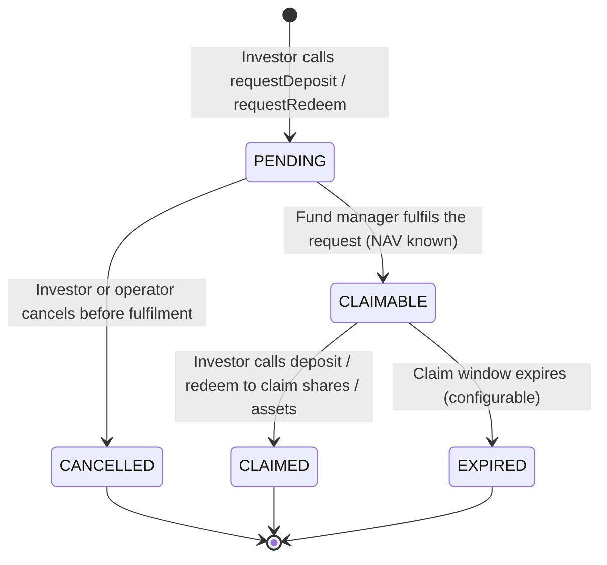

# ERC-7540 — Bóveda asíncrona { #erc-7540-asynchronous-vault }

ERC-7540 extiende ERC-4626 para fondos que no pueden procesar depósitos o reembolsos de forma instantánea. En su lugar, los inversores envían **solicitudes** que el administrador del fondo procesa en un paso de liquidación aparte. Esto modela la liquidación T+1/T+2 del mundo real para participaciones de fondos institucionales, y es el estándar para **fondos de inversión alternativos**, **fondos semilíquidos** y cualquier vehículo donde se apliquen límites de reembolso (redemption gates).

---

## Ciclo de vida de solicitud/reclamación { #requestclaim-lifecycle }

---

## Entidad `VaultRequest` { #vaultrequest-entity }

Cada solicitud de depósito o reembolso se registra en la entidad `VaultRequest`:

| Campo | Descripción |
|---|---|
| `assetId` | FK a `Asset` |
| `requestType` | `DEPOSIT` o `REDEEM` |
| `requestorAddress` | Dirección del monedero del inversor |
| `requestedAmount` | Activos (para depósito) o participaciones (para reembolso) |
| `status` | `PENDING` / `CLAIMABLE` / `CLAIMED` / `CANCELLED` / `EXPIRED` |
| `requestedAt` | Cuándo se envió la solicitud |
| `fulfilledAt` | Cuándo la procesó el administrador del fondo |
| `navAtFulfilment` | El NAV por participación utilizado para la liquidación |
| `settledAmount` | Participaciones realmente recibidas (depósito) o activos recibidos (reembolso) |
| `claimDeadline` | Cuándo expira el estado reclamable |

---

## Operaciones de administrador de fondos { #fund-manager-operations }

| Operación | Punto final | Descripción |
|---|---|---|
| Cumplir depósito | `POST /api/v1/assets/{id}/vault/fulfil-deposit` | Procesar solicitudes de depósito pendientes |
| Cumplir reembolso | `POST /api/v1/assets/{id}/vault/fulfil-redeem` | Procesar solicitudes de reembolso pendientes |
| Cancelar solicitud | `POST /api/v1/assets/{id}/vault/cancel-request` | Cancelar una solicitud pendiente (operador o inversor) |
| Lista de solicitudes pendientes | `GET /api/v1/assets/{id}/vault/requests?status=PENDING` | Ver cola |

Todas las operaciones de cumplimiento requieren REGISTRY_ADMIN y utilizan el NAV del `VaultNavStrike` más reciente. Se implementan en `Erc7540AdminPort`.

---

## Límites de reembolso (redemption gates) { #redemption-gates }

Los límites de reembolso acotan el importe total que puede reembolsarse en un único ciclo de liquidación. Esto protege la liquidez en fondos alternativos semilíquidos. En Registerwerk:

- `AssetVaultState.redemptionGate` — % máximo del total de participaciones reembolsables por ciclo (0 = sin límite)
- Si las solicitudes de un ciclo superan el límite, se cumplen de forma prorrateada; el resto pasa al ciclo siguiente
- El `VaultController` del módulo `asset` aplica el límite antes de llamar a `Erc7540AdminPort.fulfillRedeemRequest`

---

## Relación con ERC-4626 { #relationship-to-erc-4626 }

ERC-7540 es un superconjunto estricto de ERC-4626: cada bóveda ERC-7540 también implementa la interfaz ERC-4626. La diferencia es que las funciones `deposit()` y `redeem()` no liquidan inmediatamente; en cambio, completan una solicitud enviada y cumplida previamente.

Para fondos que requieren liquidación inmediata, utilice [ERC-4626](erc4626.md).
