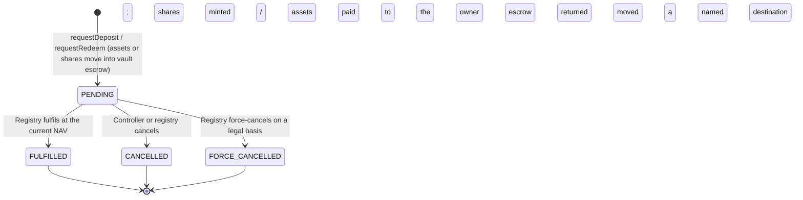

# ERC-7540 — Bóveda asíncrona { #erc-7540-asynchronous-vault }

ERC-7540 extiende ERC-4626 para fondos que no pueden procesar depósitos o reembolsos de forma instantánea. En su lugar, los inversores envían **solicitudes** que el administrador del fondo procesa en un paso de liquidación aparte. Esto modela la liquidación T+1/T+2 del mundo real para participaciones de fondos institucionales, y es el estándar para **fondos de inversión alternativos**, **fondos semilíquidos** y cualquier vehículo donde se apliquen límites de reembolso (redemption gates).

---

## Ciclo de vida de las solicitudes { #request-lifecycle }

`EwpgERC7540` utiliza **liquidación por envío** (push): cuando el registro ejecuta una solicitud, la bóveda emite las participaciones al propietario de la solicitud (depósito) o le paga los activos subyacentes (reembolso) en la misma transacción. No existe el estado `CLAIMABLE` ni un paso de reclamación separado.

```mermaid
stateDiagram-v2
    [*] --> PENDING : requestDeposit / requestRedeem (assets or shares move into vault escrow)
    PENDING --> FULFILLED : Registry fulfils at the current NAV; shares minted / assets paid to the owner
    PENDING --> CANCELLED : Controller or registry cancels; escrow returned
    PENDING --> FORCE_CANCELLED : Registry force-cancels on a legal basis; escrow moved to a named destination
    FULFILLED --> [*]
    CANCELLED --> [*]
    FORCE_CANCELLED --> [*]
```

- **Solicitud de depósito:** quien llama (el *pagador*) transfiere los activos a la bóveda. Ni el pagador ni el propietario pueden estar congelados, y el propietario debe figurar en la lista blanca. La bóveda registra al pagador (`depositRequestPayer(id)`). Una cancelación reembolsa al pagador, no al propietario.
- **Solicitud de reembolso:** las participaciones del propietario pasan a la custodia propia de la bóveda hasta que la solicitud se ejecuta o se cancela. Una cancelación las devuelve al propietario.
- La **ejecución** está reservada al registro. Requiere una fijación del NAV y que haya transcurrido `minSettlementDelay`, y se liquida al NAV vigente en el momento de la ejecución. Una vez configurada una hora de corte (dealing cut-off), ese NAV debe haberse fijado además después del punto de negociación de la solicitud (véase más abajo).
- Los puntos de entrada síncronos de ERC-4626 (`deposit`, `mint`, `withdraw`, `redeem`) revierten con `AsyncOnly`, y las vistas `max*` correspondientes devuelven `0`.

### Precio a plazo y hora de corte { #forward-pricing-and-dealing-cut-off }

Un fondo no debe permitir que un inversor negocie a un precio ya conocido. Por ello el registro configura una **hora de corte** con `setDealingCutoff(cutoffSecondsOfDay, periodSecs)`: la hora del día en UTC (de 0 a 86399 segundos) y el periodo de negociación (por defecto un día). El vault emite `DealingCutoffUpdated`.

- Cada solicitud registra su **punto de negociación** (dealing point): el primer límite de corte estrictamente posterior a la solicitud. Una solicitud anterior al corte de hoy se negocia en el corte de hoy; una realizada en el corte o después, en el de mañana. Se consulta con `dealingPointOf(requestId)`; `nextDealingPoint()` es el punto de negociación que tendría una solicitud realizada ahora.
- La ejecución exige `navStruckAt() >= dealingPointOf(requestId)`, donde `navStruckAt()` es la marca de tiempo del bloque del último `setNavPerShare`. En caso contrario revierte con `NavNotStruckAfterDealingPoint(requestId, dealingPoint, navStruckAt)`. Un NAV fijado exactamente en el punto de negociación se acepta. Una solicitud posterior al corte no puede, por tanto, liquidarse al NAV fijado para el día que perdió.
- Un cambio posterior de la hora de corte no desplaza los puntos de negociación de las solicitudes existentes.
- Mientras no se haya llamado a `setDealingCutoff` (`dealingCutoffConfigured()` es `false`), las solicitudes no llevan punto de negociación y el vault liquida como antes. Configure la hora de corte antes de ofrecer un vault a los inversores; las solicitudes anteriores conservan el comportamiento previo.

!!! note "Qué garantiza y qué no"
    La comprobación demuestra on-chain solo que el NAV se fijó después del punto de negociación. No demuestra que el NAV sea una valoración correcta a esa fecha; la fijación sigue siendo una entrada del operador anclada por su hash de informe.

### Las suscripciones pendientes son depósito en garantía, no activos del fondo { #pending-subscriptions-are-escrow-not-fund-assets }

Los activos de las solicitudes de depósito pendientes se mantienen en depósito en garantía. Se registran en `pendingDepositAssets()` y se excluyen de `totalAssets()`. Un reembolso solo puede pagarse con activos liquidados. Si el pago los supera, `fulfillRedeemRequest` revierte con `EwpgERC7540: insufficient settled liquidity`. Así, un reembolso nunca se financia con la suscripción no liquidada de otro inversor, y esa suscripción siempre puede cancelarse y reembolsarse.

!!! note "`totalAssets()` excluye las suscripciones pendientes"
    `totalAssets()` devuelve el saldo de activos subyacentes de la bóveda menos `pendingDepositAssets()`. Los paneles o indexadores que leen `totalAssets()` como patrimonio gestionado muestran valores más bajos, y correctos, que en despliegues anteriores de la bóveda.

---

## Retenciones de cumplimiento y cancelación forzada { #compliance-holds-and-forced-cancellation }

Una dirección congelada queda retenida en su lugar:

- `fulfillRedeemRequest` revierte mientras el propietario de la solicitud esté congelado. La ejecución de un depósito a favor de un propietario congelado la bloquea el hook de cumplimiento de la transferencia de participaciones.
- `cancelDepositRequest` revierte mientras el destinatario del reembolso (el pagador) esté congelado. `cancelRedeemRequest` revierte mientras el propietario esté congelado.
- Los activos o participaciones en depósito permanecen en la bóveda hasta que se descongele la dirección.
- `forcedTransfer`, `forceBurn` y `forcedApprove` revierten cuando se aplican a la propia dirección de la bóveda. La custodia propia de la bóveda contiene las participaciones de todos los reembolsos pendientes; una operación forzada sobre ella dejaría sin financiación las solicitudes de otros inversores.

Para liberar una solicitud retenida con base jurídica, el registro llama a `forceCancelDepositRequest(id, to, legalBasis)` o `forceCancelRedeemRequest(id, to, legalBasis)`. El depósito (activos o participaciones) va al destino `to` designado para ese caso, y la bóveda emite `ForcedRequestCancelled(requestId, to, legalBasis)`. Las demás solicitudes pendientes no se ven afectadas.

!!! note "Política de destino"
    El contrato no decide adónde va el depósito de un inversor congelado. Por defecto permanece en la bóveda. Si se traslada, y cuándo, a una cuenta de activos bloqueados controlada por el registro o a otro lugar es una decisión de negocio y jurídica que se toma caso por caso.

---

## Entidad `VaultRequest` { #vaultrequest-entity }

Cada solicitud de depósito o reembolso se registra en la entidad `VaultRequest`. Los inversores llaman a `requestDeposit` / `requestRedeem` directamente en la bóveda; el backend incorpora las filas a partir de los registros de eventos finalizados de la bóveda (`DepositRequested`, `RedeemRequested` y los eventos de ejecución y cancelación), incluidas las solicitudes canceladas por el propio controlador:

| Campo | Descripción |
|---|---|
| `assetId` | FK a `Asset` |
| `requestId` | ID de la solicitud on-chain |
| `requestType` | `DEPOSIT` o `REDEEM` |
| `controllerAddr` / `ownerAddr` | Direcciones del controlador y del propietario de la solicitud |
| `assetAmount` / `shareAmount` | Activos (depósito) o participaciones (reembolso), más la contrapartida liquidada |
| `requestStatus` | `PENDING` / `FULFILLED` / `CANCELLED` / `FORCE_CANCELLED` |
| `payerAddr` | Quién financió una solicitud de depósito (`depositRequestPayer`); los reembolsos por cancelación van a esta dirección |
| `requestedAt` | Cuándo se envió la solicitud |
| `fulfilledAt` / `fulfilledTx` | Cuándo y en qué transacción se ejecutó la solicitud |
| `navAtFulfill` | El NAV por participación utilizado para la liquidación, leído del evento on-chain `*RequestFulfilled` (nunca introducido por el operador) |
| `cancelledTx` | La transacción de cancelación |
| `forcedToAddr` / `legalBasis` | Destino del depósito y base jurídica de una cancelación forzosa del registro |

---

## Operaciones del administrador del fondo { #fund-manager-operations }

| Operación | Endpoint | Descripción |
|---|---|---|
| Fijar el NAV | `POST /api/v1/deployments/{depId}/nav-strike` | Registrar un nuevo NAV por participación on-chain |
| Listar solicitudes | `GET /api/v1/deployments/{depId}/vault-requests?status=PENDING` | Ver la cola |
| Ejecutar solicitud | `POST /api/v1/deployments/{depId}/vault-requests/{requestId}/fulfill` | Ejecutar una solicitud de depósito o reembolso pendiente |
| Cancelar solicitud | `POST /api/v1/deployments/{depId}/vault-requests/{requestId}/cancel` | Cancelar una solicitud pendiente |
| Estado de la bóveda | `GET /api/v1/deployments/{depId}/vault-state` | Fijación del NAV confirmada a la que se liquidará la ejecución |
| Cancelación forzosa | `POST /api/v1/deployments/{depId}/vault-requests/{requestId}/force-cancel` | Cuerpo `{to, legalBasis}`; libera el depósito de una solicitud retenida al destino indicado. Requiere step-up y un segundo aprobador |

Todas las operaciones requieren REGISTRY_ADMIN. La ejecución utiliza el NAV de la fijación on-chain más reciente. Las operaciones están implementadas en `Erc7540AdminPort`. Antes de enviar, el backend rechaza una ejecución si el propietario de la solicitud está congelado en la bóveda o sujeto a un Sperrvermerk, y rechaza una cancelación si lo está el destinatario del reembolso. El controlador no se comprueba. Estas solicitudes aparecen en la cola como retención de cumplimiento, y solo una cancelación forzosa puede mover su depósito. Cada envío se simula primero, de modo que un revert del contrato devuelve un error claro en lugar de una transacción fallida.

---

## Límites de reembolso { #redemption-gates }

!!! note "No hay ningún límite de reembolso implementado"
    Registerwerk no aplica ningún límite de reembolso (redemption gate). Ni el contrato ni el backend limitan el importe reembolsado por ciclo de liquidación, y no existe ejecución a prorrata. Cada reembolso se ejecuta individualmente. El único límite on-chain es la liquidez liquidada descrita arriba. Los fondos semilíquidos que necesiten un límite deben aplicarlo operativamente hasta que se desarrolle.

---

## Relación con ERC-4626 { #relationship-to-erc-4626 }

Toda bóveda ERC-7540 expone también la interfaz ERC-4626 para vistas, conversiones y transferencias de participaciones. Las funciones síncronas `deposit()`, `mint()`, `withdraw()` y `redeem()` están desactivadas: los activos y las participaciones solo se mueven a través del ciclo de vida de solicitudes descrito arriba.

Para fondos que requieren liquidación inmediata, utilice [ERC-4626](erc4626.md).
