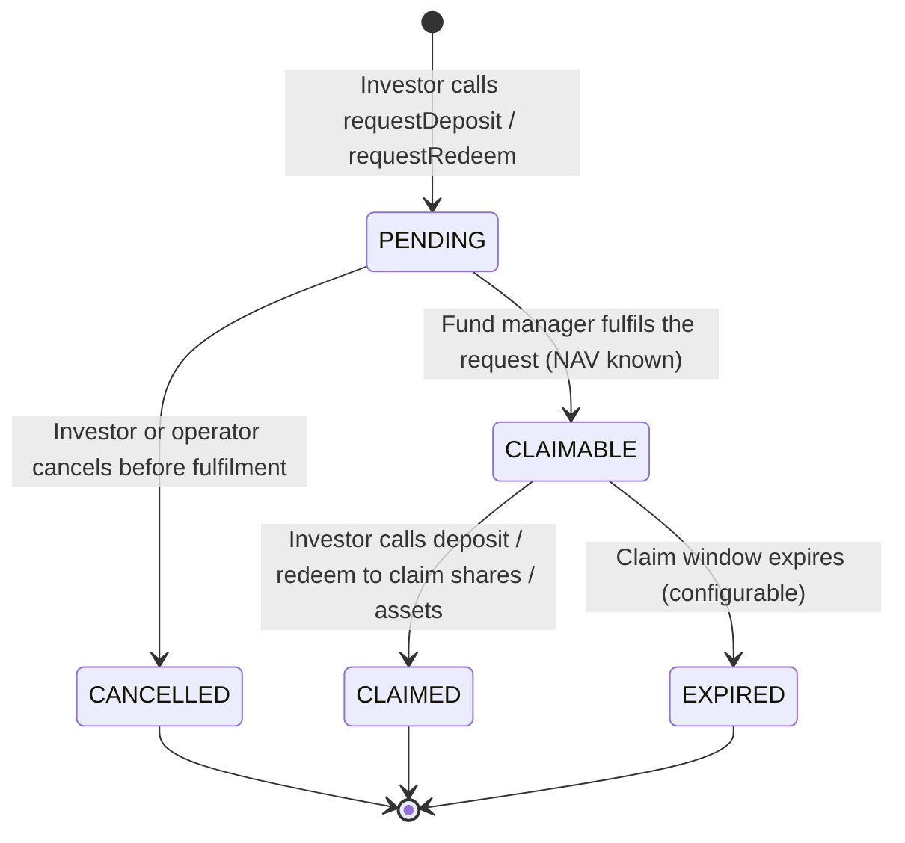

# ERC-7540 — Coffre asynchrone { #erc-7540-asynchronous-vault }

ERC-7540 étend ERC-4626 pour les fonds qui ne peuvent pas traiter les dépôts ou les rachats instantanément. Au lieu de cela, les investisseurs soumettent des **demandes** que le gestionnaire de fonds traite lors d'une étape de règlement distincte. Ce modèle modélise le règlement T+1/T+2 réel pour les actions de fonds institutionnels et constitue la norme pour les **fonds d'investissement alternatifs**, les **fonds semi-liquides** et tout véhicule pour lequel des barrières de rachat s'appliquent.

---

## Cycle de vie des demandes/réclamations { #requestclaim-lifecycle }

---

## Entité `VaultRequest` { #vaultrequest-entity }

Chaque demande de dépôt ou de rachat est suivie dans l'entité `VaultRequest` :

| Champ | Description |
|---|---|
| `assetId` | FK à `Asset` |
| `requestType` | `DEPOSIT` ou `REDEEM` |
| `requestorAddress` | Adresse du portefeuille de l'investisseur |
| `requestedAmount` | Actifs (à déposer) ou actions (à racheter) |
| `status` | `PENDING` / `CLAIMABLE` / `CLAIMED` / `CANCELLED` / `EXPIRED` |
| `requestedAt` | Lorsque la demande a été soumise |
| `fulfilledAt` | Lorsque le gestionnaire du fonds l'a traité |
| `navAtFulfilment` | Le NAV par action utilisé pour le règlement |
| `settledAmount` | Actions réelles reçues (dépôt) ou actifs reçus (rachat) |
| `claimDeadline` | Lorsque le statut de réclamation expire |

---

## Opérations du gestionnaire de fonds { #fund-manager-operations }

| Opération | Point de terminaison | Description |
|---|---|---|
| Effectuer le dépôt | `POST /api/v1/assets/{id}/vault/fulfil-deposit` | Traiter les demandes de dépôt en attente |
| Effectuer le rachat | `POST /api/v1/assets/{id}/vault/fulfil-redeem` | Traiter les demandes de rachat en attente |
| Annuler la demande | `POST /api/v1/assets/{id}/vault/cancel-request` | Annuler une demande en attente (opérateur ou investisseur) |
| Liste des demandes en attente | `GET /api/v1/assets/{id}/vault/requests?status=PENDING` | Afficher la file d'attente |

Toutes les opérations d'exécution nécessitent REGISTRY_ADMIN et utilisent le NAV du `VaultNavStrike` le plus récent. Ils sont implémentés dans `Erc7540AdminPort`.

---

## Gates de rachat { #redemption-gates }

Les gates de rachat limitent le montant total pouvant être remboursé au cours d'un seul cycle de règlement. Cela protège la liquidité des fonds alternatifs semi-liquides. Dans Registerwerk :

- `AssetVaultState.redemptionGate` — % maximum du total des actions rachetables par cycle (0 = pas de gate)
- Si les demandes dans un cycle dépassent la gate, elles sont exécutées au prorata ; le reste passe au cycle suivant
- Le `VaultController` du module `asset` applique la gate avant d'appeler `Erc7540AdminPort.fulfillRedeemRequest`

---

## Relation avec ERC-4626 { #relationship-to-erc-4626 }

ERC-7540 est un sur-ensemble strict de ERC-4626 : chaque coffre-fort ERC-7540 implémente également l'interface ERC-4626. La différence est que les fonctions `deposit()` et `redeem()` ne sont pas réglées immédiatement ; elles complètent plutôt une demande préalablement soumise et exécutée.

Pour les fonds nécessitant un règlement immédiat, utilisez [ERC-4626](erc4626.md).
