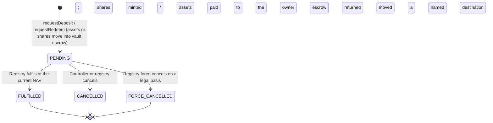

# ERC-7540 — Coffre asynchrone { #erc-7540-asynchronous-vault }

ERC-7540 étend ERC-4626 pour les fonds qui ne peuvent pas traiter les dépôts ou les rachats instantanément. Au lieu de cela, les investisseurs soumettent des **demandes** que le gestionnaire de fonds traite lors d'une étape de règlement distincte. Ce modèle modélise le règlement T+1/T+2 réel pour les actions de fonds institutionnels et constitue la norme pour les **fonds d'investissement alternatifs**, les **fonds semi-liquides** et tout véhicule pour lequel des barrières de rachat s'appliquent.

---

## Cycle de vie des demandes { #request-lifecycle }

`EwpgERC7540` utilise un **règlement poussé** (push) : lorsque le registre exécute une demande, le coffre émet les parts au propriétaire de la demande (dépôt) ou lui verse les actifs sous-jacents (rachat) dans la même transaction. Il n'existe ni statut `CLAIMABLE` ni étape de réclamation distincte.

```mermaid
stateDiagram-v2
    [*] --> PENDING : requestDeposit / requestRedeem (assets or shares move into vault escrow)
    PENDING --> FULFILLED : Registry fulfils at the current NAV; shares minted / assets paid to the owner
    PENDING --> CANCELLED : Controller or registry cancels; escrow returned
    PENDING --> FORCE_CANCELLED : Registry force-cancels on a legal basis; escrow moved to a named destination
    FULFILLED --> [*]
    CANCELLED --> [*]
    FORCE_CANCELLED --> [*]
```

- **Demande de dépôt :** l'appelant (le *payeur*) transfère les actifs dans le coffre. Ni le payeur ni le propriétaire ne peuvent être gelés, et le propriétaire doit figurer sur la liste blanche. Le coffre enregistre le payeur (`depositRequestPayer(id)`). Une annulation rembourse le payeur, et non le propriétaire.
- **Demande de rachat :** les parts du propriétaire passent sous la garde du coffre jusqu'à l'exécution ou l'annulation de la demande. Une annulation les restitue au propriétaire.
- L'**exécution** est réservée au registre. Elle exige une fixation de la NAV et l'écoulement de `minSettlementDelay`, et se règle à la NAV en vigueur au moment de l'exécution. Une fois une heure limite (dealing cut-off) configurée, cette NAV doit en outre avoir été fixée après le point de négociation de la demande (voir ci-dessous).
- Les points d'entrée synchrones ERC-4626 (`deposit`, `mint`, `withdraw`, `redeem`) échouent avec `AsyncOnly`, et les vues `max*` correspondantes renvoient `0`.

### Prix à terme et heure limite { #forward-pricing-and-dealing-cut-off }

Un fonds ne doit pas laisser un investisseur négocier à un prix déjà connu. Le registre configure donc une **heure limite** avec `setDealingCutoff(cutoffSecondsOfDay, periodSecs)` : l'heure du jour en UTC (de 0 à 86399 secondes) et la période de négociation (par défaut un jour). Le vault émet `DealingCutoffUpdated`.

- Chaque demande enregistre son **point de négociation** (dealing point) : la première limite strictement postérieure à la demande. Une demande antérieure à l'heure limite du jour se négocie à l'heure limite du jour ; une demande faite à l'heure limite ou après, à celle du lendemain. Il se lit avec `dealingPointOf(requestId)` ; `nextDealingPoint()` est le point de négociation qu'obtiendrait une demande faite maintenant.
- L'exécution exige `navStruckAt() >= dealingPointOf(requestId)`, où `navStruckAt()` est l'horodatage de bloc du dernier `setNavPerShare`. Sinon elle revert avec `NavNotStruckAfterDealingPoint(requestId, dealingPoint, navStruckAt)`. Une NAV fixée exactement au point de négociation est acceptée. Une demande postérieure à l'heure limite ne peut donc pas être réglée à la NAV fixée pour la journée qu'elle a manquée.
- Une modification ultérieure de l'heure limite ne déplace pas les points de négociation des demandes existantes.
- Tant que `setDealingCutoff` n'a pas été appelé (`dealingCutoffConfigured()` vaut `false`), les demandes ne portent pas de point de négociation et le vault règle comme avant. Configurez l'heure limite avant de proposer un vault aux investisseurs ; les demandes antérieures gardent l'ancien comportement.

!!! note "Ce que cela garantit et ce que cela ne garantit pas"
    Le contrôle prouve on-chain seulement que la NAV a été fixée après le point de négociation. Il ne prouve pas que la NAV est une valorisation correcte à cette date ; la fixation reste une saisie de l'opérateur ancrée par son hash de rapport.

### Les souscriptions en attente sont un séquestre, pas des actifs du fonds { #pending-subscriptions-are-escrow-not-fund-assets }

Les actifs des demandes de dépôt en attente sont détenus en séquestre. Ils sont suivis dans `pendingDepositAssets()` et exclus de `totalAssets()`. Un rachat ne peut être payé qu'à partir des actifs réglés. Si le versement les dépasse, `fulfillRedeemRequest` échoue avec `EwpgERC7540: insufficient settled liquidity`. Un rachat n'est donc jamais financé par la souscription non réglée d'un autre investisseur, et cette souscription peut toujours être annulée et remboursée.

!!! note "`totalAssets()` exclut les souscriptions en attente"
    `totalAssets()` renvoie le solde d'actifs sous-jacents du coffre diminué de `pendingDepositAssets()`. Les tableaux de bord ou indexeurs qui lisent `totalAssets()` comme encours affichent des valeurs plus basses, et correctes, que pour les déploiements de coffre antérieurs.

---

## Blocages de conformité et annulation forcée { #compliance-holds-and-forced-cancellation }

Une adresse gelée est bloquée sur place :

- `fulfillRedeemRequest` échoue tant que le propriétaire de la demande est gelé. L'exécution d'un dépôt au profit d'un propriétaire gelé est bloquée par le hook de conformité du transfert de parts.
- `cancelDepositRequest` échoue tant que le bénéficiaire du remboursement (le payeur) est gelé. `cancelRedeemRequest` échoue tant que le propriétaire est gelé.
- Les actifs ou parts en séquestre restent dans le coffre jusqu'au dégel de l'adresse.
- `forcedTransfer`, `forceBurn` et `forcedApprove` échouent lorsqu'ils visent l'adresse du coffre lui-même. La garde propre du coffre détient les parts de tous les rachats en attente ; une opération forcée sur celle-ci rendrait les demandes des autres investisseurs impossibles à financer.

Pour libérer une demande bloquée sur une base juridique, le registre appelle `forceCancelDepositRequest(id, to, legalBasis)` ou `forceCancelRedeemRequest(id, to, legalBasis)`. Le séquestre (actifs ou parts) est transféré à la destination `to` désignée pour ce cas, et le coffre émet `ForcedRequestCancelled(requestId, to, legalBasis)`. Les autres demandes en attente ne sont pas affectées.

!!! note "Politique de destination"
    Le contrat ne décide pas où va le séquestre d'un investisseur gelé. Par défaut, il reste dans le coffre. Son transfert éventuel vers un compte d'actifs bloqués contrôlé par le registre, ou ailleurs, relève d'une décision métier et juridique prise au cas par cas.

---

## Entité `VaultRequest` { #vaultrequest-entity }

Chaque demande de dépôt ou de rachat est suivie dans l'entité `VaultRequest`. Les investisseurs appellent `requestDeposit` / `requestRedeem` directement sur le coffre ; le backend intègre les lignes à partir des journaux d'événements finalisés du coffre (`DepositRequested`, `RedeemRequested` ainsi que les événements d'exécution et d'annulation), y compris les demandes annulées par le contrôleur lui-même :

| Champ | Description |
|---|---|
| `assetId` | FK à `Asset` |
| `requestId` | Identifiant de la demande on-chain |
| `requestType` | `DEPOSIT` ou `REDEEM` |
| `controllerAddr` / `ownerAddr` | Adresses du contrôleur et du propriétaire de la demande |
| `assetAmount` / `shareAmount` | Actifs (dépôt) ou parts (rachat), ainsi que la contrepartie réglée |
| `requestStatus` | `PENDING` / `FULFILLED` / `CANCELLED` / `FORCE_CANCELLED` |
| `payerAddr` | Qui a financé une demande de dépôt (`depositRequestPayer`) ; les remboursements en cas d'annulation vont à cette adresse |
| `requestedAt` | Date de soumission de la demande |
| `fulfilledAt` / `fulfilledTx` | Date et transaction d'exécution de la demande |
| `navAtFulfill` | La NAV par part utilisée pour le règlement, lue dans l'événement on-chain `*RequestFulfilled` (jamais saisie par l'opérateur) |
| `cancelledTx` | La transaction d'annulation |
| `forcedToAddr` / `legalBasis` | Destination du séquestre et base juridique d'une annulation forcée par le registre |

---

## Opérations du gestionnaire de fonds { #fund-manager-operations }

| Opération | Point de terminaison | Description |
|---|---|---|
| Fixer la NAV | `POST /api/v1/deployments/{depId}/nav-strike` | Enregistrer une nouvelle NAV par part on-chain |
| Lister les demandes | `GET /api/v1/deployments/{depId}/vault-requests?status=PENDING` | Afficher la file d'attente |
| Exécuter une demande | `POST /api/v1/deployments/{depId}/vault-requests/{requestId}/fulfill` | Exécuter une demande de dépôt ou de rachat en attente |
| Annuler une demande | `POST /api/v1/deployments/{depId}/vault-requests/{requestId}/cancel` | Annuler une demande en attente |
| État du coffre | `GET /api/v1/deployments/{depId}/vault-state` | Fixation de NAV confirmée à laquelle l'exécution sera réglée |
| Annulation forcée | `POST /api/v1/deployments/{depId}/vault-requests/{requestId}/force-cancel` | Corps `{to, legalBasis}` ; libère le séquestre d'une demande bloquée vers la destination désignée. Step-up et second approbateur requis |

Toutes les opérations nécessitent REGISTRY_ADMIN. L'exécution utilise la NAV de la fixation on-chain la plus récente. Les opérations sont implémentées dans `Erc7540AdminPort`. Avant l'envoi, le backend refuse une exécution lorsque le propriétaire de la demande est gelé sur le coffre ou soumis à un Sperrvermerk, et refuse une annulation lorsque c'est le cas du destinataire du remboursement. Le contrôleur n'est pas vérifié. Ces demandes apparaissent dans la file comme blocage de conformité, et seule une annulation forcée peut déplacer leur séquestre. Chaque envoi est d'abord simulé, de sorte qu'un revert du contrat renvoie une erreur claire au lieu d'une transaction échouée.

---

## Gates de rachat { #redemption-gates }

!!! note "Aucune gate de rachat n'est implémentée"
    Registerwerk n'applique pas de gate de rachat. Ni le contrat ni le backend ne limitent le montant racheté par cycle de règlement, et il n'y a pas d'exécution au prorata. Chaque rachat est exécuté individuellement. La seule limite on-chain est la liquidité réglée décrite ci-dessus. Les fonds semi-liquides qui ont besoin d'une gate doivent l'appliquer de manière organisationnelle jusqu'à ce qu'elle soit développée.

---

## Relation avec ERC-4626 { #relationship-to-erc-4626 }

Chaque coffre ERC-7540 expose également l'interface ERC-4626 pour les vues, les conversions et les transferts de parts. Les fonctions synchrones `deposit()`, `mint()`, `withdraw()` et `redeem()` sont désactivées : les actifs et les parts ne circulent que via le cycle de vie des demandes décrit ci-dessus.

Pour les fonds nécessitant un règlement immédiat, utilisez [ERC-4626](erc4626.md).
