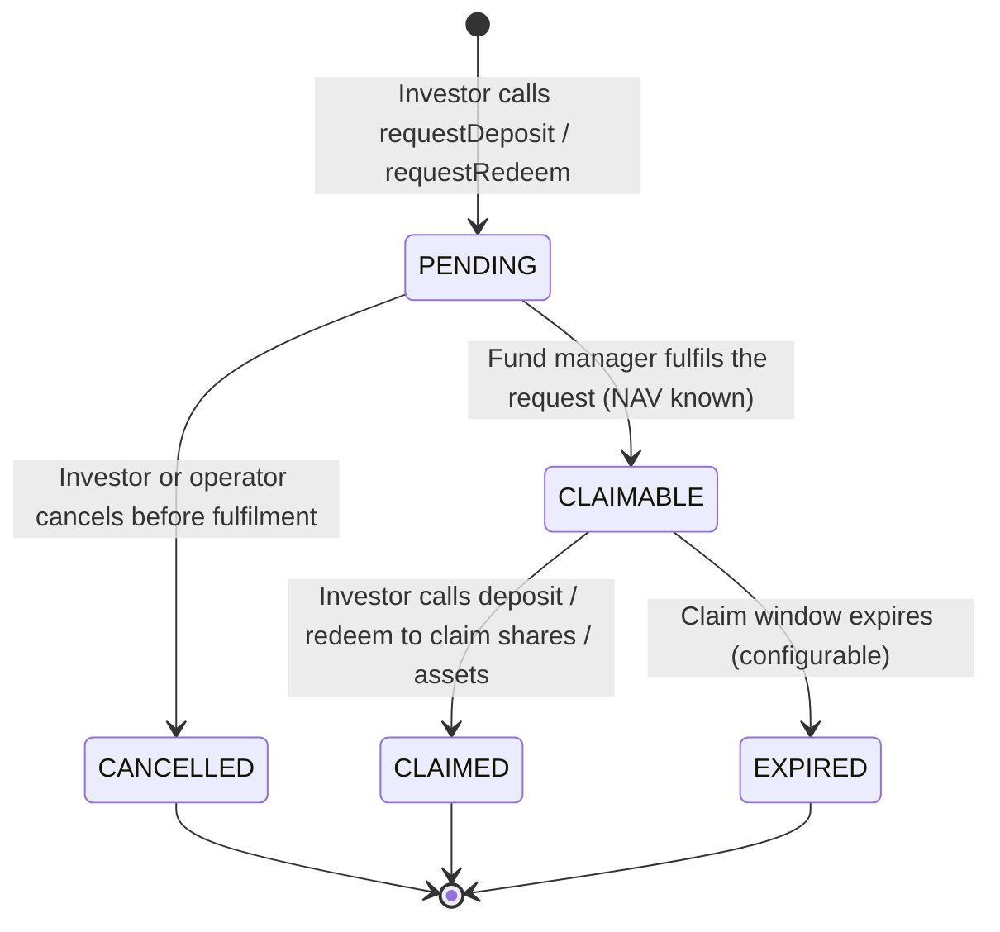

# ERC-7540 — Vault asincrono { #erc-7540-asynchronous-vault }

ERC-7540 estende ERC-4626 per i fondi che non possono elaborare depositi o rimborsi istantaneamente. Gli investitori, invece, presentano **richieste** che il gestore del fondo elabora in una fase di liquidazione separata. Questo modella il regolamento T+1/T+2 nel mondo reale per le quote di fondi istituzionali ed è lo standard per **fondi di investimento alternativi**, **fondi semiliquidi** e qualsiasi veicolo a cui si applicano soglie di rimborso.

---

## Ciclo di vita di richiesta/riscossione { #requestclaim-lifecycle }

---

## `VaultRequest` entità { #vaultrequest-entity }

Ogni richiesta di deposito o riscatto viene tracciata nell'entità `VaultRequest`:

| Campo | Descrizione |
|---|---|
| `assetId` | FK a `Asset` |
| `requestType` | `DEPOSIT` o `REDEEM` |
| `requestorAddress` | Indirizzo del portafoglio dell'investitore |
| `requestedAmount` | Asset (per deposito) o azioni (per riscatto) |
| `status` | `PENDING` / `CLAIMABLE` / `CLAIMED` / `CANCELLED` / `EXPIRED` |
| `requestedAt` | Quando è stata inviata la richiesta |
| `fulfilledAt` | Quando il gestore del fondo l'ha elaborata |
| `navAtFulfilment` | Il valore NAV per azione utilizzato per il regolamento |
| `settledAmount` | Azioni effettive ricevute (deposito) o beni ricevuti (riscatto) |
| `claimDeadline` | Alla scadenza dello stato rivendicabile |

---

## Operazioni del gestore del fondo { #fund-manager-operations }

| Operazione | Endpoint | Descrizione |
|---|---|---|
| Evadi il deposito | `POST /api/v1/assets/{id}/vault/fulfil-deposit` | Elabora le richieste di deposito in sospeso |
| Evadi il riscatto | `POST /api/v1/assets/{id}/vault/fulfil-redeem` | Elabora le richieste di riscatto in sospeso |
| Annulla richiesta | `POST /api/v1/assets/{id}/vault/cancel-request` | Annulla una richiesta in sospeso (operatore o investitore) |
| Elenca richieste in sospeso | `GET /api/v1/assets/{id}/vault/requests?status=PENDING` | Visualizza coda |

Tutte le operazioni di evasione ordini richiedono REGISTRY_ADMIN e utilizzano il NAV del più recente `VaultNavStrike`. Sono implementate in `Erc7540AdminPort`.

---

## Gate di rimborso { #redemption-gates }

I gate di rimborso limitano l'importo totale che può essere riscattato in un singolo ciclo di liquidazione. Ciò protegge la liquidità nei fondi alternativi semiliquidi. In Registerwerk:

- `AssetVaultState.redemptionGate` — % massima delle azioni totali riscattabili per ciclo (0 = nessun gate)
- Se le richieste in un ciclo superano il gate, vengono soddisfatte su base proporzionale; il resto passa al ciclo successivo
- `VaultController` del modulo `asset` applica il gate prima di chiamare `Erc7540AdminPort.fulfillRedeemRequest`

---

## Relazione con ERC-4626 { #relationship-to-erc-4626 }

ERC-7540 è un superset rigoroso di ERC-4626: ogni vault ERC-7540 implementa anche l'interfaccia ERC-4626. La differenza è che le funzioni `deposit()` e `redeem()` non si regolano immediatamente, ma completano una richiesta precedentemente inviata e soddisfatta.

Per fondi che richiedono un regolamento immediato, utilizzare [ERC-4626](erc4626.md).
