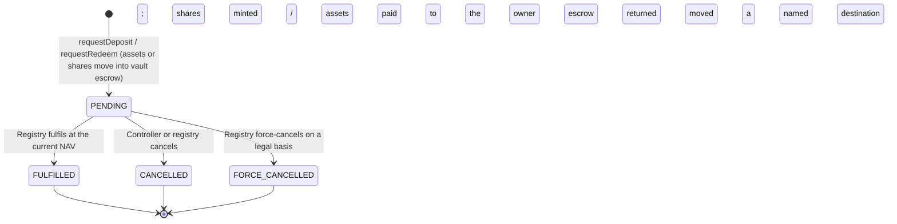

# ERC-7540 — Vault asincrono { #erc-7540-asynchronous-vault }

ERC-7540 estende ERC-4626 per i fondi che non possono elaborare depositi o rimborsi istantaneamente. Gli investitori, invece, presentano **richieste** che il gestore del fondo elabora in una fase di liquidazione separata. Questo modella il regolamento T+1/T+2 nel mondo reale per le quote di fondi istituzionali ed è lo standard per **fondi di investimento alternativi**, **fondi semiliquidi** e qualsiasi veicolo a cui si applicano soglie di rimborso.

---

## Ciclo di vita delle richieste { #request-lifecycle }

`EwpgERC7540` utilizza il **regolamento push**: quando il registro esegue una richiesta, il vault conia le quote al proprietario della richiesta (deposito) o gli paga gli asset sottostanti (rimborso) nella stessa transazione. Non esistono uno stato `CLAIMABLE` né una fase di riscossione separata.

```mermaid
stateDiagram-v2
    [*] --> PENDING : requestDeposit / requestRedeem (assets or shares move into vault escrow)
    PENDING --> FULFILLED : Registry fulfils at the current NAV; shares minted / assets paid to the owner
    PENDING --> CANCELLED : Controller or registry cancels; escrow returned
    PENDING --> FORCE_CANCELLED : Registry force-cancels on a legal basis; escrow moved to a named destination
    FULFILLED --> [*]
    CANCELLED --> [*]
    FORCE_CANCELLED --> [*]
```

- **Richiesta di deposito:** il chiamante (il *pagatore*) trasferisce gli asset nel vault. Né il pagatore né il proprietario possono essere congelati, e il proprietario deve essere nella whitelist. Il vault registra il pagatore (`depositRequestPayer(id)`). Un annullamento rimborsa il pagatore, non il proprietario.
- **Richiesta di rimborso:** le quote del proprietario passano nella custodia propria del vault finché la richiesta non viene eseguita o annullata. Un annullamento le restituisce al proprietario.
- L'**esecuzione** è riservata al registro. Richiede una fissazione del NAV e il decorso di `minSettlementDelay`, e regola al NAV vigente al momento dell'esecuzione. Una volta configurato un orario limite (dealing cut-off), tale NAV deve inoltre essere stato fissato dopo il punto di negoziazione della richiesta (vedi sotto).
- I punti di ingresso sincroni ERC-4626 (`deposit`, `mint`, `withdraw`, `redeem`) vanno in revert con `AsyncOnly`, e le viste `max*` corrispondenti restituiscono `0`.

### Forward pricing e orario limite { #forward-pricing-and-dealing-cut-off }

Un fondo non deve consentire a un investitore di negoziare a un prezzo già noto. Il registro configura quindi un **orario limite** con `setDealingCutoff(cutoffSecondsOfDay, periodSecs)`: l'ora del giorno in UTC (da 0 a 86399 secondi) e il periodo di negoziazione (di default un giorno). Il vault emette `DealingCutoffUpdated`.

- Ogni richiesta registra il proprio **punto di negoziazione** (dealing point): il primo limite strettamente successivo alla richiesta. Una richiesta precedente all'orario limite di oggi viene negoziata all'orario limite di oggi; una effettuata all'orario limite o dopo, a quello di domani. Si legge con `dealingPointOf(requestId)`; `nextDealingPoint()` è il punto di negoziazione che otterrebbe una richiesta effettuata ora.
- L'esecuzione richiede `navStruckAt() >= dealingPointOf(requestId)`, dove `navStruckAt()` è il timestamp di blocco dell'ultimo `setNavPerShare`. In caso contrario va in revert con `NavNotStruckAfterDealingPoint(requestId, dealingPoint, navStruckAt)`. Un NAV fissato esattamente al punto di negoziazione è accettato. Una richiesta successiva all'orario limite non può quindi essere regolata al NAV fissato per il giorno perso.
- Una successiva modifica dell'orario limite non sposta i punti di negoziazione delle richieste esistenti.
- Finché `setDealingCutoff` non è stato chiamato (`dealingCutoffConfigured()` è `false`), le richieste non hanno un punto di negoziazione e il vault regola come prima. Configurare l'orario limite prima di offrire un vault agli investitori; le richieste precedenti mantengono il comportamento precedente.

!!! note "Cosa garantisce e cosa no"
    Il controllo dimostra on-chain solo che il NAV è stato fissato dopo il punto di negoziazione. Non dimostra che il NAV sia una valutazione corretta a quella data; la fissazione resta un input dell'operatore ancorato dal suo hash di report.

### Le sottoscrizioni in sospeso sono deposito vincolato, non patrimonio del fondo { #pending-subscriptions-are-escrow-not-fund-assets }

Gli asset delle richieste di deposito in sospeso sono tenuti in deposito vincolato. Sono tracciati in `pendingDepositAssets()` ed esclusi da `totalAssets()`. Un rimborso può essere pagato solo con asset regolati. Se il pagamento li supera, `fulfillRedeemRequest` va in revert con `EwpgERC7540: insufficient settled liquidity`. Un rimborso non viene quindi mai finanziato con la sottoscrizione non regolata di un altro investitore, e tale sottoscrizione può sempre essere annullata e rimborsata.

!!! note "`totalAssets()` esclude le sottoscrizioni in sospeso"
    `totalAssets()` restituisce il saldo di asset sottostanti del vault meno `pendingDepositAssets()`. Dashboard o indexer che leggono `totalAssets()` come patrimonio gestito mostrano valori più bassi, e corretti, rispetto ai precedenti deployment del vault.

---

## Blocchi di conformità e annullamento forzato { #compliance-holds-and-forced-cancellation }

Un indirizzo congelato resta bloccato sul posto:

- `fulfillRedeemRequest` va in revert finché il proprietario della richiesta è congelato. L'esecuzione di un deposito a favore di un proprietario congelato è bloccata dall'hook di conformità del trasferimento di quote.
- `cancelDepositRequest` va in revert finché il destinatario del rimborso (il pagatore) è congelato. `cancelRedeemRequest` va in revert finché il proprietario è congelato.
- Gli asset o le quote in deposito vincolato restano nel vault finché l'indirizzo non viene scongelato.
- `forcedTransfer`, `forceBurn` e `forcedApprove` vanno in revert se applicati all'indirizzo del vault stesso. La custodia propria del vault detiene le quote di tutti i rimborsi in sospeso; un'operazione forzata su di essa renderebbe non finanziabili le richieste di altri investitori.

Per sbloccare una richiesta trattenuta su una base giuridica, il registro chiama `forceCancelDepositRequest(id, to, legalBasis)` o `forceCancelRedeemRequest(id, to, legalBasis)`. Il deposito vincolato (asset o quote) va alla destinazione `to` indicata per il singolo caso, e il vault emette `ForcedRequestCancelled(requestId, to, legalBasis)`. Le altre richieste in sospeso non sono interessate.

!!! note "Politica di destinazione"
    Il contratto non decide dove finisce il deposito vincolato di un investitore congelato. Per impostazione predefinita resta nel vault. Se e quando trasferirlo su un conto di asset bloccati controllato dal registro o altrove è una decisione di business e legale presa caso per caso.

---

## `VaultRequest` entità { #vaultrequest-entity }

Ogni richiesta di deposito o rimborso è tracciata nell'entità `VaultRequest`. Gli investitori chiamano `requestDeposit` / `requestRedeem` direttamente sul vault; il backend acquisisce le righe dai log degli eventi finalizzati del vault (`DepositRequested`, `RedeemRequested` e gli eventi di esecuzione e annullamento), comprese le richieste annullate dal controller stesso:

| Campo | Descrizione |
|---|---|
| `assetId` | FK a `Asset` |
| `requestId` | ID della richiesta on-chain |
| `requestType` | `DEPOSIT` o `REDEEM` |
| `controllerAddr` / `ownerAddr` | Indirizzi del controller e del proprietario della richiesta |
| `assetAmount` / `shareAmount` | Asset (deposito) o quote (rimborso), più la controparte regolata |
| `requestStatus` | `PENDING` / `FULFILLED` / `CANCELLED` / `FORCE_CANCELLED` |
| `payerAddr` | Chi ha finanziato una richiesta di deposito (`depositRequestPayer`); i rimborsi in caso di annullamento vanno a questo indirizzo |
| `requestedAt` | Quando è stata presentata la richiesta |
| `fulfilledAt` / `fulfilledTx` | Quando e in quale transazione la richiesta è stata eseguita |
| `navAtFulfill` | Il NAV per quota utilizzato per il regolamento, letto dall'evento on-chain `*RequestFulfilled` (mai inserito dall'operatore) |
| `cancelledTx` | La transazione di annullamento |
| `forcedToAddr` / `legalBasis` | Destinazione del deposito vincolato e base giuridica di un annullamento forzato del registro |

---

## Operazioni del gestore del fondo { #fund-manager-operations }

| Operazione | Endpoint | Descrizione |
|---|---|---|
| Fissare il NAV | `POST /api/v1/deployments/{depId}/nav-strike` | Registrare un nuovo NAV per quota on-chain |
| Elencare le richieste | `GET /api/v1/deployments/{depId}/vault-requests?status=PENDING` | Visualizzare la coda |
| Eseguire una richiesta | `POST /api/v1/deployments/{depId}/vault-requests/{requestId}/fulfill` | Eseguire una richiesta di deposito o rimborso in sospeso |
| Annullare una richiesta | `POST /api/v1/deployments/{depId}/vault-requests/{requestId}/cancel` | Annullare una richiesta in sospeso |
| Stato del vault | `GET /api/v1/deployments/{depId}/vault-state` | Fissazione del NAV confermata a cui verrà regolata l'esecuzione |
| Annullamento forzato | `POST /api/v1/deployments/{depId}/vault-requests/{requestId}/force-cancel` | Corpo `{to, legalBasis}`; rilascia il deposito vincolato di una richiesta trattenuta verso la destinazione indicata. Richiede step-up e un secondo approvatore |

Tutte le operazioni richiedono REGISTRY_ADMIN. L'esecuzione utilizza il NAV della fissazione on-chain più recente. Le operazioni sono implementate in `Erc7540AdminPort`. Prima dell'invio, il backend rifiuta un'esecuzione se il proprietario della richiesta è congelato sul vault o soggetto a uno Sperrvermerk, e rifiuta un annullamento se lo è il destinatario del rimborso. Il controller non viene verificato. Tali richieste compaiono nella coda come blocco di conformità, e solo un annullamento forzato può spostarne il deposito vincolato. Ogni invio viene prima simulato, così un revert del contratto restituisce un errore chiaro invece di una transazione fallita.

---

## Gate di rimborso { #redemption-gates }

!!! note "Nessun gate di rimborso è implementato"
    Registerwerk non applica alcun gate di rimborso. Né il contratto né il backend limitano l'importo rimborsato per ciclo di regolamento, e non esiste un'esecuzione pro rata. Ogni rimborso viene eseguito singolarmente. L'unico limite on-chain è la liquidità regolata descritta sopra. I fondi semiliquidi che necessitano di un gate devono applicarlo a livello operativo finché non verrà sviluppato.

---

## Relazione con ERC-4626 { #relationship-to-erc-4626 }

Ogni vault ERC-7540 espone anche l'interfaccia ERC-4626 per viste, conversioni e trasferimenti di quote. Le funzioni sincrone `deposit()`, `mint()`, `withdraw()` e `redeem()` sono disattivate: asset e quote si muovono solo attraverso il ciclo di vita delle richieste descritto sopra.

Per i fondi che richiedono un regolamento immediato, utilizzare [ERC-4626](erc4626.md).
