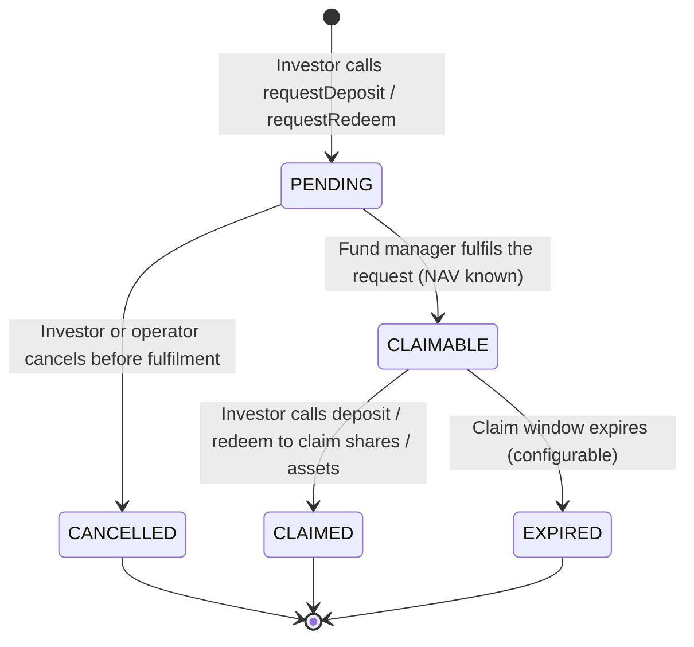

# ERC-7540 — Asynchronous Vault

ERC-7540 extends ERC-4626 for funds that cannot process deposits or redemptions instantaneously. Instead, investors submit **requests** that the fund manager processes in a separate settlement step. This models real-world T+1 / T+2 settlement for institutional fund shares, and is the standard for **alternative investment funds**, **semi-liquid funds**, and any vehicle where redemption gates apply.

---

## Request/claim lifecycle

---

## `VaultRequest` entity

Each deposit or redemption request is tracked in the `VaultRequest` entity:

| Field | Description |
|---|---|
| `assetId` | FK to `Asset` |
| `requestType` | `DEPOSIT` or `REDEEM` |
| `requestorAddress` | Investor's wallet address |
| `requestedAmount` | Assets (for deposit) or shares (for redeem) |
| `status` | `PENDING` / `CLAIMABLE` / `CLAIMED` / `CANCELLED` / `EXPIRED` |
| `requestedAt` | When the request was submitted |
| `fulfilledAt` | When the fund manager processed it |
| `navAtFulfilment` | The NAV per share used for settlement |
| `settledAmount` | Actual shares received (deposit) or assets received (redeem) |
| `claimDeadline` | When the claimable status expires |

---

## Fund manager operations

| Operation | Endpoint | Description |
|---|---|---|
| Fulfil deposit | `POST /api/v1/assets/{id}/vault/fulfil-deposit` | Process pending deposit requests |
| Fulfil redeem | `POST /api/v1/assets/{id}/vault/fulfil-redeem` | Process pending redemption requests |
| Cancel request | `POST /api/v1/assets/{id}/vault/cancel-request` | Cancel a pending request (operator or investor) |
| List pending requests | `GET /api/v1/assets/{id}/vault/requests?status=PENDING` | View queue |

All fulfilment operations require REGISTRY_ADMIN and use the NAV from the most recent `VaultNavStrike`. They are implemented in `Erc7540AdminPort`.

---

## Redemption gates

Redemption gates limit the total amount that can be redeemed in a single settlement cycle. This protects liquidity in semi-liquid alternative funds. In Registerwerk:

- `AssetVaultState.redemptionGate` — maximum % of total shares redeemable per cycle (0 = no gate)
- If requests in a cycle exceed the gate, they are fulfilled on a pro-rata basis; the remainder rolls over to the next cycle
- The `asset` module's `VaultController` enforces the gate before calling `Erc7540AdminPort.fulfillRedeemRequest`

---

## Relationship to ERC-4626

ERC-7540 is a strict superset of ERC-4626: every ERC-7540 vault also implements the ERC-4626 interface. The difference is that the `deposit()` and `redeem()` functions do not immediately settle — instead, they complete a previously submitted and fulfilled request.

For funds requiring immediate settlement, use [ERC-4626](erc4626.md).
