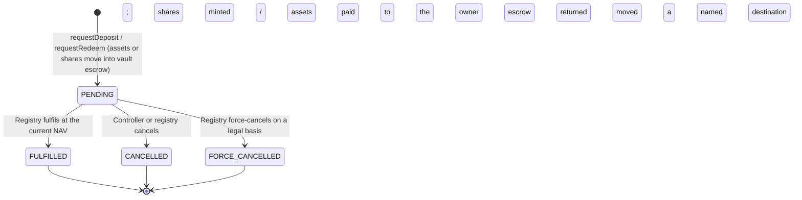

# ERC-7540 — Asynchronous Vault

ERC-7540 extends ERC-4626 for funds that cannot process deposits or redemptions instantaneously. Instead, investors submit **requests** that the fund manager processes in a separate settlement step. This models real-world T+1 / T+2 settlement for institutional fund shares, and is the standard for **alternative investment funds**, **semi-liquid funds**, and any vehicle where redemption gates apply.

---

## Request lifecycle

`EwpgERC7540` uses **push settlement**: when the registry fulfils a request, the vault mints the shares to the request owner (deposit) or pays the underlying assets to the request owner (redemption) in the same transaction. There is no `CLAIMABLE` state and no separate claim step.

```mermaid
stateDiagram-v2
    [*] --> PENDING : requestDeposit / requestRedeem (assets or shares move into vault escrow)
    PENDING --> FULFILLED : Registry fulfils at the current NAV; shares minted / assets paid to the owner
    PENDING --> CANCELLED : Controller or registry cancels; escrow returned
    PENDING --> FORCE_CANCELLED : Registry force-cancels on a legal basis; escrow moved to a named destination
    FULFILLED --> [*]
    CANCELLED --> [*]
    FORCE_CANCELLED --> [*]
```

- **Deposit request:** the caller (the *payer*) transfers the assets into the vault. Neither the payer nor the owner may be frozen, and the owner must be whitelisted. The vault records the payer (`depositRequestPayer(id)`). A cancellation refunds the payer, not the owner.
- **Redeem request:** the owner's shares move into vault self-custody until the request is fulfilled or cancelled. A cancellation returns them to the owner.
- **Fulfilment** is registry-only. It requires a NAV strike and an elapsed `minSettlementDelay`, and it settles at the NAV current at fulfilment time.
- The synchronous ERC-4626 entry points (`deposit`, `mint`, `withdraw`, `redeem`) revert with `AsyncOnly`, and the matching `max*` views return `0`.

### Pending subscriptions are escrow, not fund assets

Assets of pending deposit requests are held in escrow. They are tracked in `pendingDepositAssets()` and excluded from `totalAssets()`. A redemption can only be paid out of settled assets. If the payout exceeds them, `fulfillRedeemRequest` reverts with `EwpgERC7540: insufficient settled liquidity`. So a redemption is never funded from another investor's unsettled subscription, and that subscription can always be cancelled and refunded.

!!! note "`totalAssets()` excludes pending subscriptions"
    `totalAssets()` returns the vault's underlying balance minus `pendingDepositAssets()`. Dashboards or indexers that read `totalAssets()` as AUM show lower, correct values than earlier vault deployments did.

---

## Compliance holds and forced cancellation

A frozen address is held in place:

- `fulfillRedeemRequest` reverts while the request owner is frozen. A deposit fulfilment to a frozen owner is blocked by the share-transfer compliance hook.
- `cancelDepositRequest` reverts while the refund recipient (the payer) is frozen. `cancelRedeemRequest` reverts while the owner is frozen.
- The escrowed assets or shares stay in the vault until the address is unfrozen.
- `forcedTransfer`, `forceBurn` and `forcedApprove` revert when applied to the vault's own address. Vault self-custody holds the escrowed shares of every pending redemption, so a forced operation on it would leave other investors' requests unfundable.

To release a held request on a legal basis, the registry calls `forceCancelDepositRequest(id, to, legalBasis)` or `forceCancelRedeemRequest(id, to, legalBasis)`. The escrow (underlying assets or shares) goes to the destination `to` named for that case, and the vault emits `ForcedRequestCancelled(requestId, to, legalBasis)`. Other pending requests are not affected.

!!! note "Destination policy"
    The contract does not decide where a frozen investor's escrow goes. By default it stays in the vault. Whether and when it moves to a registry-controlled blocked-assets account or elsewhere is a product and legal decision made per case.

---

## `VaultRequest` entity

Each deposit or redemption request is tracked in the `VaultRequest` entity. Investors call `requestDeposit` / `requestRedeem` directly on the vault; the backend ingests the rows from the vault's finalized event logs (`DepositRequested`, `RedeemRequested`, and the fulfilment and cancellation events), including requests cancelled by the controller itself:

| Field | Description |
|---|---|
| `assetId` | FK to `Asset` |
| `requestId` | On-chain request ID |
| `requestType` | `DEPOSIT` or `REDEEM` |
| `controllerAddr` / `ownerAddr` | Controller and owner addresses of the request |
| `assetAmount` / `shareAmount` | Assets (deposit) or shares (redeem), plus the settled counterpart |
| `requestStatus` | `PENDING` / `FULFILLED` / `CANCELLED` / `FORCE_CANCELLED` |
| `payerAddr` | Who funded a deposit request (`depositRequestPayer`); cancel refunds go here |
| `requestedAt` | When the request was submitted |
| `fulfilledAt` / `fulfilledTx` | When and in which transaction the request was fulfilled |
| `navAtFulfill` | The NAV per share used for settlement, read from the on-chain `*RequestFulfilled` event (never typed by the operator) |
| `cancelledTx` | The cancellation transaction |
| `forcedToAddr` / `legalBasis` | Escrow destination and legal basis of a registry force-cancel |

---

## Fund manager operations

| Operation | Endpoint | Description |
|---|---|---|
| Strike NAV | `POST /api/v1/deployments/{depId}/nav-strike` | Record a new NAV per share on-chain |
| List requests | `GET /api/v1/deployments/{depId}/vault-requests?status=PENDING` | View the queue |
| Fulfil request | `POST /api/v1/deployments/{depId}/vault-requests/{requestId}/fulfill` | Fulfil a pending deposit or redemption request |
| Cancel request | `POST /api/v1/deployments/{depId}/vault-requests/{requestId}/cancel` | Cancel a pending request |
| Vault state | `GET /api/v1/deployments/{depId}/vault-state` | Confirmed NAV strike that fulfilment will settle at |
| Force-cancel request | `POST /api/v1/deployments/{depId}/vault-requests/{requestId}/force-cancel` | Body `{to, legalBasis}`; releases a held request's escrow to the named destination. Step-up and a second approver required |

All operations require REGISTRY_ADMIN. Fulfilment uses the NAV of the most recent on-chain strike. The operations are implemented in `Erc7540AdminPort`. Before submitting, the backend refuses a fulfilment when the request owner is frozen on the vault or under a Sperrvermerk, and refuses a cancel when the refund recipient is. The controller is not checked. Such requests show as a compliance hold in the queue, and only a force-cancel can move their escrow. Each submission is simulated first, so a contract revert returns a clear error instead of a failed transaction.

---

## Redemption gates

!!! note "No redemption gate is implemented"
    Registerwerk does not enforce a redemption gate. Neither the contract nor the backend limits the amount redeemed per settlement cycle, and there is no pro-rata fulfilment. Each redemption is fulfilled individually. The only on-chain limit is the settled liquidity described above. Semi-liquid funds that need a gate must apply it operationally until one is built.

---

## Relationship to ERC-4626

Every ERC-7540 vault also exposes the ERC-4626 interface for views, conversions and share transfers. The synchronous `deposit()`, `mint()`, `withdraw()` and `redeem()` functions are disabled: assets and shares move only through the request lifecycle above.

For funds requiring immediate settlement, use [ERC-4626](erc4626.md).
